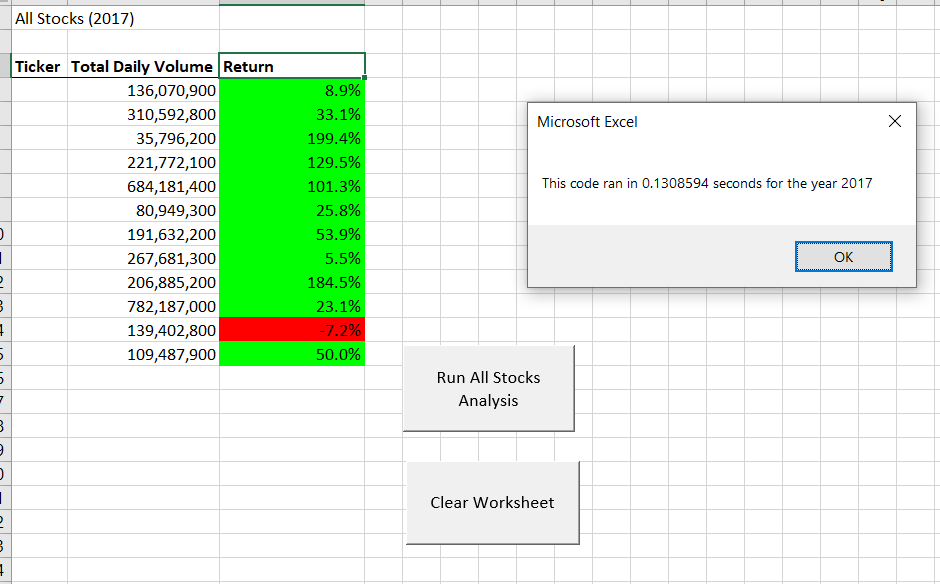
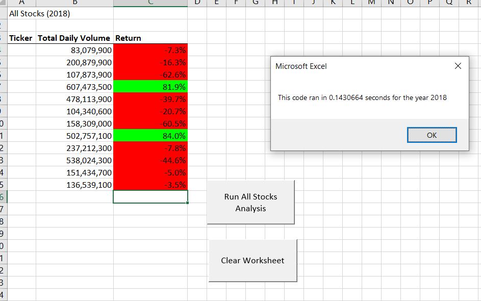

# Simplification of Refactored Code for Stock Analysis

## Overview of Project
### The purpose of this analysis was to obtain the current code from the initial stock analysis and coding provided to Steve ensuring that the data perceived is displayed at the click of a button and with minimal user input.

### The initial analysis compared to the refactored analysis contains the same data (from 2017 and 2018), however the main goal was to add buttons to calculate and obtain a total analysis for each year and have it displayed by ticker symbol in an easy-to-read format.  As an enhancement to the analysis, the user wished to have the code run in a more efficient manner and to have the data display to include the required formatting.  Initially, the formatting was done as an additional step, so that would entail more user intervention as well as adding time to make the spreadsheet edits.  Refactoring the code allowed for this formatting to be combined with the data analysis portion in one step.  The formatting adds color-coding and percentages which gains a more palatable sense of the annual returns for each ticker by simply expressing green for positive and red for negative returns.  Since the formatting was combined with the code within the refactor, one click will display the pertinent data in a matter of milliseconds.  An additional button was added in the event the user would like to clear the screen to display another year's data on both the initial and refactored studies.

## Results: Using images of examples of your code, compare the stock performance between 2017 and 2018 as well as the execution times of the original script and the refactored script

### The initial code allowed for the analysis to be first displayed in a plain format.  The time displayed does not include the formatting as depicted below:

### Upon adding the necessary formatting to each of the charts, the end result would display thusly:

### To add, an additional button could have been added to just code the formatting as a secondary step to the "Run All Stocks Analysis" button, however, since the refactoring was required, it seemed natural to include the formatting into the refactoring so that the data could easily be obtained in one step for any user.

## Summary: In a summary statement, address the following questions.
- What are the advantages or disadvantages of refactoring code?
### Refactoring code can be both a blessing and a curse.  To explain, it's quite nice to have some code that was already created so that you understand what's required.  However, it can take quite a bit of time to diagnose and really figure out the changes.  As I'm a bit new to coding in general, getting familiar with the new tools is a a challenge on its own.
- How do these pros and cons apply to refactoring the original VBA script?
### Refactoring the code in this challenge was definitely a pro.  I get a bit confused on how to diagnose looping for example.  If I'm not able to see what the line of code is iterating through, it doesn't make sense to me.  So I've learned that I am able to step through and figure out what's working and what's not working.  I had a session with my tutor as well and he helped me figure out how to utilize the 'Immediate' pane.  With that I was able to trouble shoot my code and really nail down what the issues were.  One con in refactoring is the time it takes to go through and edit.  It seems as though it may be easier to start from scratch and write the entire script from the beginning to the end.  Either way, I believe this entire two week challenge was a great learning experience for me and I strive to get better at this as the weeks progress through this course.